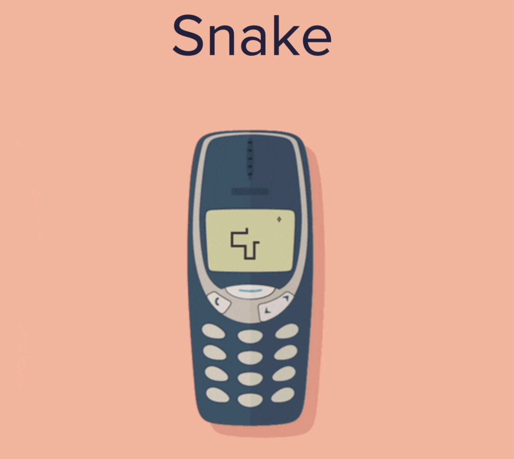

<a name="readme-top"></a>

[![Contributors][contributors-shield]][contributors-url]
[![Forks][forks-shield]][forks-url]
[![Stargazers][stars-shield]][stars-url]
[![Issues][issues-shield]][issues-url]
[![MIT License][license-shield]][license-url]
[![LinkedIn][linkedin-shield]][linkedin-url]

<!-- PROJECT LOGO -->
<br />
<div align="center">
  <a href="https://github.com/senabibi/Snake_Game">
    
  </a>

<h3 align="center">Snake Game </h3>

  <p align="center">
     Snake Game is a classic arcade-style game where you control a snake to collect food and avoid collisions with walls and itself. I used Python and the Pygame library to build it, including features like scoring, graphics, and a game over screen. Players control the snake with arrow keys, aim to eat food, and try to achieve the highest score without crashing. It's a fun and nostalgic game project showcasing Python game development.
    <br />
    <a href="https://github.com/senabibi/Snake_Game"><strong>Explore the docs »</strong></a>
    <br />
    <br />
    <a href="https://github.com/senabibi/Snake_Game">View Demo</a>
    ·
    <a href="https://github.com/senabibi/Snake_Game/issues">Report Bug</a>
    ·
    <a href="https://github.com/senabibi/Snake_Game/issues">Request Feature</a>
  </p>
</div>


<!-- TABLE OF CONTENTS -->
<details>
  <summary>Table of Contents</summary>
  <ol>
    <li>
      <a href="#about-the-project">About The Project</a>
      <ul>
        <li><a href="#built-with">Built With</a></li>
      </ul>
    </li>
    <li>
      <a href="#getting-started">Getting Started</a>
      <ul>
        <li><a href="#prerequisites">Prerequisites</a></li>
        <li><a href="#installation">Installation</a></li>
      </ul>
    </li>
    <li><a href="#usage">Usage</a></li>
    <li><a href="#roadmap">Roadmap</a></li>
    <li><a href="#contributing">Contributing</a></li>
    <li><a href="#license">License</a></li>
    <li><a href="#contact">Contact</a></li>
    <li><a href="#acknowledgments">Acknowledgments</a></li>
  </ol>
</details>


## About The Project


Here's a video demonstrating the Snake Game Simulator in action:
<p align="center">
  
</p>


This Python-based Snake Game project, utilizing Turtle graphics, offers a lively implementation of a classic arcade game. In the game, the snake grows as it consumes food, and its score is visually tracked after each meal. Moreover, one of the project's unique features allows players to store their highest scores in memory. This feature is visually emphasized using Turtle graphics, satisfying the competitive spirit of players and aiding them in monitoring and improving their performance. The game provides a fun and educational example of Python game development while reviving the timeless appeal of the classic Snake Game.


<p align="right">(<a href="#readme-top">back to top</a>)</p>

### Built With

* [![Python][Python.py]][Python-url]
* [![Replit][Replit.com]][Replit-url]
* [![PYCHARM][Pycharm.com]][Pycharm-url]
* [![Vısual Studio Code][vsc.com]][VSC-url]
* [![BRAVE][brave.com]][BRAVE-url]


<p align="right">(<a href="#readme-top">back to top</a>)</p>

## Getting Started

This section provides instructions on how to set up and run the project locally. Please follow these steps to get your environment ready.

### Prerequisites

Before you begin, make sure you have the following prerequisites installed on your system:

* [Python](https://www.python.org/downloads/): You'll need Python to run this project.

* [Replit](https://replit.com): This project is designed to work with Replit, so you'll need to have a Replit account and be familiar with using it.

* [PyCharm](https://www.jetbrains.com/pycharm/download/): If you prefer running the project locally in PyCharm, make sure to install PyCharm on your system.

* [Turtle Graphics Library](https://docs.python.org/3/library/turtle.html): Ensure that you have the Turtle graphics library installed, which is typically included with Python.

### Installation

Follow these steps to install and run the project:

1. **Python Installation:**
   - Download and install Python from the [official Python website](https://www.python.org/downloads/).

2. **Replit Usage:**
   - You can run this project on Replit by following these steps:
     - Create a Replit account if you don't have one.
     - Import the project into Replit or create a new Replit project.
     - Open the main Python script in Replit and run it.

3. **PyCharm Installation and Usage:**
   - Download and install PyCharm from the [official website](https://www.jetbrains.com/pycharm/download/).
   - Open the project in PyCharm.
   - Configure PyCharm to use the installed Python interpreter.
   - Run the main Python script in PyCharm.

Make sure you have the Turtle graphics library available in your Python environment, which is typically included with Python. Following these steps, you can run the project either in Replit or locally in PyCharm, depending on your preference.

<p align="right">(<a href="#readme-top">back to top</a>)</p>


## Usage

To use this Snake Game project, follow these steps to set up your environment and play the game:

1. **Python Installation:**
   - Ensure that you have Python installed on your system. If not, you can download and install Python from the [official Python website](https://www.python.org/downloads/).

2. **Turtle Graphics Library:**
   - This project uses the Turtle graphics library. Typically, it is included with Python, so no additional installation is required.

3. **Starting the Game:**
   - Open your terminal or command prompt, navigate to the project's directory, and run the following command:
     ```
     python snake_game.py
     ```
   - This command will start the Snake Game, and you can control the snake using the arrow keys.

4. **Game Objective:**
   - Guide the snake to eat food, grow in length, and earn points without colliding with the walls or the snake's own body.

5. **High Score:**
   - The game automatically records and displays the highest score achieved.

6. **Modifications and Development:**
   - Feel free to explore and modify the project's source code to customize the game or add new features.

This usage guide provides the necessary steps to set up your environment and enjoy the Snake Game. You can also dive into the source code to customize and expand the game further.


## Roadmap

- [ ] Python Installation: Make sure you have the latest Python version installed for project development.
- [ ] Project Setup: Set up your project environment, and consider using a development platform like Replit for ease of development.
- [ ] Core Game Mechanics: Begin by implementing the core mechanics of the Snake Game, including snake movement, food generation, and collision controls.
- [ ] Graphics Enhancements: Use Turtle graphics to improve the appearance of the snake and food, making the game visually appealing.
- [ ] Scoring System: Create a scoring system that allows players to track their scores and record the highest score.
- [ ] Game Over Screen: Add a "Game Over" screen that informs players when the snake collides with walls or itself and provides an option to restart.
- [ ] Advanced Features: Consider adding new and more complex features to the game, such as increasing the snake's speed or introducing special abilities.
- [ ] Testing and Debugging: Ensure the game runs smoothly by adding tests and addressing any issues or bugs.
- [ ] Documentation: Create a user guide or documentation that explains how to play the game and its features.

This roadmap provides a step-by-step plan for the development of your Snake Game project, covering everything from initial setup to advanced gameplay features.

<p align="right">(<a href="#readme-top">back to top</a>)</p>


## Contributing

Contributions are what make the open-source community such an amazing place to learn, inspire, and create. Any contributions you make are **greatly appreciated**.

If you have a suggestion that would make this project better, please fork the repository and create a pull request. You can also simply open an issue with the "enhancement" tag.
Don't forget to give the project a star! Thanks again!

1. Fork the Project
2. Create your Feature Branch (`git checkout -b feature/AmazingFeature`)
3. Commit your Changes (`git commit -m 'Add some AmazingFeature'`)
4. Push to the Branch (`git push origin feature/AmazingFeature`)
5. Open a Pull Request

<p align="right">(<a href="#readme-top">back to top</a>)</p>


## License

Distributed under the MIT License. See `LICENSE.txt` for more information.

<p align="right">(<a href="#readme-top">back to top</a>)</p>


## Contact

Nursena Bitirgen - [LinkedIn](https://www.linkedin.com/in/nursena-bitirgen-5743341b9/)

Project Link: [https://github.com/senabibi/Snake_Game](https://github.com/senabibi/Snake_Game)

<p align="right">(<a href="#readme-top">back to top</a>)</p>


## Acknowledgments

The development of this project was made possible thanks to the following resources and skills:

* **Python Knowledge:** Special thanks to the Python programming language for its robust and versatile capabilities.
* **OOP Expertise:** Acknowledgment to the world of Object-Oriented Programming (OOP) for providing a solid foundation for this project.
* **Data Structure Proficiency:** Gratitude for the knowledge of data structures, which played a crucial role in shaping this project.
* **Turtle Graphics Proficiency:** Special acknowledgment for the proficiency in using Turtle graphics, which brought the visual elements of the project to life.
* **Replit Proficiency:** The ability to work with Replit was instrumental in the development of this project.

<p align="right">(<a href="#readme-top">back to top</a>)</p>


<!-- MARKDOWN LINKS & IMAGES -->
<!-- https://www.markdownguide.org/basic-syntax/#reference-style-links -->
[contributors-shield]: https://img.shields.io/github/contributors/senabibi/Coffee_Machine.svg?style=for-the-badge
[contributors-url]: https://github.com/senabibi/Coffee_Machine/graphs/contributors
[forks-shield]: https://img.shields.io/github/forks/senabibi/Coffee_Machine.svg?style=for-the-badge
[forks-url]: https://github.com/senabibi/Coffee_Machine/network/members
[stars-shield]: https://img.shields.io/github/stars/senabibi/Coffee_Machine.svg?style=for-the-badge
[stars-url]: https://github.com/senabibi/Coffee_Machine/stargazers
[issues-shield]: https://img.shields.io/github/issues/senabibi/Coffee_Machine.svg?style=for-the-badge
[issues-url]: https://github.com/senabibi/Coffee_Machine/issues
[license-shield]: https://img.shields.io/github/license/senabibi/Coffee_Machine.svg?style=for-the-badge
[license-url]: https://github.com/senabibi/Coffee_Machine/blob/master/LICENSE.txt
[linkedin-shield]: https://img.shields.io/badge/-LinkedIn-black.svg?style=for-the-badge&logo=linkedin&colorB=555
[linkedin-url]: https://www.linkedin.com/in/nursena-bitirgen-5743341b9/
[product-screenshot]: images/logo.png

[Python.py]: https://img.shields.io/badge/Python-3776AB?style=for-the-badge&logo=python&logoColor=white
[Python-url]: https://docs.python.org/3/

[Replit.com]: https://img.shields.io/badge/replit-667881?style=for-the-badge&logo=replit&logoColor=white
[Replit-url]: https://replit.com/

[Pycharm.com]: https://img.shields.io/badge/PyCharm-000000.svg?&style=for-the-badge&logo=PyCharm&logoColor=white
[Pycharm-url]: https://www.jetbrains.com/pycharm/

[vsc.com]: 	https://img.shields.io/badge/Visual_Studio_Code-0078D4?style=for-the-badge&logo=visual%20studio%20code&logoColor=white
[VSC-url]: https://code.visualstudio.com/

[brave.com]:https://img.shields.io/badge/Brave-FF1B2D?style=for-the-badge&logo=Brave&logoColor=white
[BRAVE-url]: https://brave.com/


